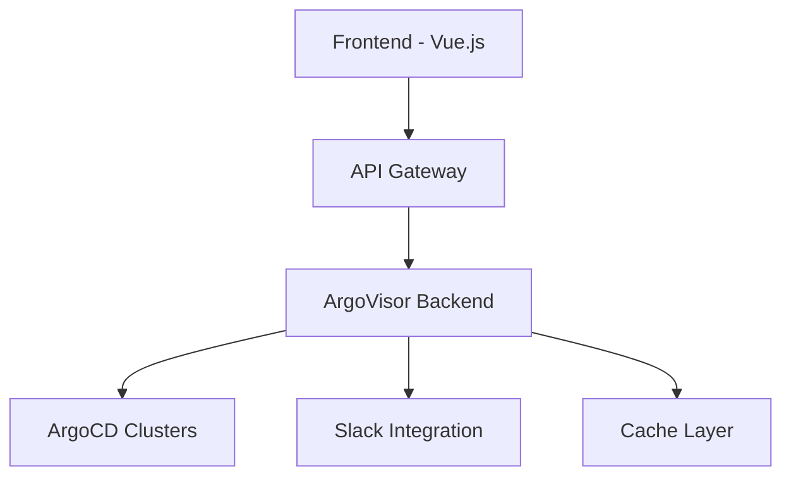

# ArgoVisor - ArgoCD Cluster Monitoring Service

Advanced monitoring solution for ArgoCD clusters, providing real-time health tracking and management capabilities.

## 🚀 Features

- Multi-cluster ArgoCD monitoring
- Real-time application health status
- Sync status tracking
- Critical Slack notifications
- Daily status reports
- RESTful API
- Dark/Light theme
- Auto/Manual refresh options

## 🔧 Technical Stack

### Backend
- Node.js
- Express.js
- Winston logger
- Node-cache
- Axios
- CORS & Compression
- Slack Webhook Integration

### Frontend
- Vue 3
- Naive UI
- Axios
- Lucide Icons


## 🌐 API Endpoints

| Endpoint | Method | Description |
|----------|--------|-------------|
| `/metrics` | GET | Returns overall metrics |
| `/applications` | GET | Lists all cluster applications |
| `/status` | GET | Shows service status |
| `/refresh` | POST | Updates data |
| `/clusters/:name/sync` | POST | Synchronizes specific cluster |

## 💻 Development

```bash
# Backend development
npm run dev
```

## 🚦 Health Check

Service monitors:
- Application health status
- Sync status
- Processing state
- Degraded/Failed conditions

## 🛡️ Security

- Rate limiting
- CORS protection
- SSL/TLS support
- Token-based auth



