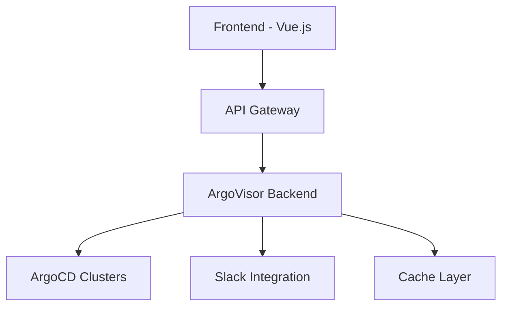

# ArgoVisor 🚀

[](https://opensource.org/licenses/MIT)
[](https://nodejs.org/)
[](https://www.docker.com/)

ArgoVisor is a monitoring service for ArgoCD clusters that provides real-time status updates, health checks, and Slack notifications for your Kubernetes applications.

## 🌟 Features

- Real-time monitoring of multiple ArgoCD clusters
- Health status tracking for all applications
- Automated Slack notifications for degraded services
- RESTful API for integration with other tools
- Configurable alerts and monitoring intervals
- Docker support for easy deployment

## 📋 Prerequisites

- Node.js >= 18.0.0
- Docker >= 20.10.0 (optional)
- Access to ArgoCD clusters
- Slack webhook URL (for notifications)

## 📊 Architecture



## 🚀 Quick Start

### Using Node.js

1. Clone the repository:
```bash
git clone https://github.com/sametkls00/argovisor.git
cd argovisor
```

2. Install dependencies:
```bash
npm install
```

3. Create environment file:
```bash
cp .env.example .env
```

4. Configure your environment variables in `.env`:
```env
PORT=3000
ALLOWED_ORIGINS=http://localhost:8080
EXCLUDED_APPS=argocd-apps,argocd-initialize
UPDATE_INTERVAL=60000
ALERT_INTERVAL=86400000
ARGOVISOR_URL=http://localhost:3000
SLACK_WEBHOOK_URL=your-webhook-url
```

5. Start the service:
```bash
npm start
```

### Using Docker

1. Build and run using Docker Compose:
```bash
docker-compose up --build
```

## 🔧 Configuration

### Cluster Configuration

Configure your ArgoCD clusters in `config/clusters.js`:

```javascript
// Example configuration
const clusters = {
    "CLUSTER_1": {
        url: process.env.CLUSTER_1_URL,
        username: process.env.CLUSTER_1_USERNAME,
        password: process.env.CLUSTER_1_PASSWORD
    }
    // Add more clusters as needed
};
```

### Environment Variables

| Variable | Description | Default |
|----------|-------------|---------|
| PORT | Server port | 3000 |
| ALLOWED_ORIGINS | CORS allowed origins | http://localhost:8080 |
| EXCLUDED_APPS | Comma-separated list of apps to exclude | argocd-apps,argocd-initialize |
| UPDATE_INTERVAL | Monitoring interval in ms | 60000 |
| ALERT_INTERVAL | Minimum time between alerts in ms | 86400000 |
| SLACK_WEBHOOK_URL | Slack webhook URL for notifications | - |

## 📡 API Endpoints

| Endpoint | Method | Description |
|----------|--------|-------------|
| `/test` | GET | Health check endpoint |
| `/metrics` | GET | Get current metrics for all clusters |
| `/applications` | GET | List all applications and their status |
| `/status` | GET | Get service status and last update time |
| `/refresh` | POST | Force refresh of all cluster data |
| `/clusters/:name/sync` | POST | Sync specific cluster |

## 🔍 Monitoring

ArgoVisor monitors the following application states:

- Health Status: `Healthy`, `Degraded`, `Missing`, `Unknown`
- Sync Status: `Synced`, `OutOfSync`, `Processing`

### Slack Notifications

ArgoVisor sends notifications to Slack when:
- Applications become degraded or out of sync
- Applications recover from problematic states
- Clusters become unreachable

## 🛠️ Development

```bash
# Run in development mode
npm run dev

# Run tests
npm test

# Run linting
npm run lint
```

## 🔒 Security

- All sensitive information should be stored in environment variables
- CORS is configured to allow only specific origins
- Authentication tokens are cached securely
- Regular security updates for dependencies

## 📖 Contributing

1. Fork the repository
2. Create your feature branch (`git checkout -b feature/amazing-feature`)
3. Commit your changes (`git commit -m 'Add some amazing feature'`)
4. Push to the branch (`git push origin feature/amazing-feature`)
5. Open a Pull Request

## 📄 License

This project is licensed under the MIT License - see the [LICENSE](LICENSE) file for details.
